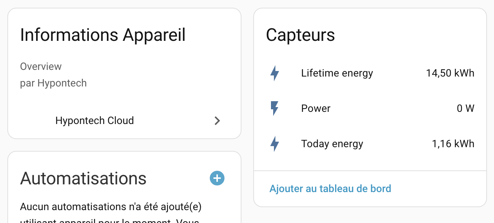

# Hypontech Cloud Integration for Home Assistant

**This custom component is maintained alongside the Home Assistant core integration. Changes are synced from the core repository (PR https://github.com/home-assistant/core/pull/159442).**


Custom component for integrating Hypontech Cloud systems with Home Assistant.


## Installation

### HACS (Recommended)

1. Open HACS in your Home Assistant instance
2. Go to "Integrations"
3. Click the three dots in the top right corner
4. Select "Custom repositories"
5. Add this repository URL: `https://github.com/jcisio/hypontech-homeassistant`
6. Select category "Integration"
7. Click "Add"
8. Find "Hypontech Cloud" in the list and click "Install"
9. Restart Home Assistant

### Manual Installation

1. Copy the `custom_components/hypontech` directory to your Home Assistant's `custom_components` directory
2. Restart Home Assistant

## Configuration

1. Go to Settings -> Devices & Services
2. Click "+ Add Integration"
3. Search for "Hypontech Cloud"
4. Follow the configuration steps to enter your credentials

## Features

- Monitor your Hypontech energy production and storage system
- Real-time data updates
- Sensor entities for solar production power, energy, and more

## Requirements

- Home Assistant 2025.12.0 or later
- Hypontech Cloud account with valid credentials

## Support

For issues and feature requests, please use the [GitHub issue tracker](https://github.com/jcisio/hypontech-homeassistant/issues).

## Development

### Making Changes

1. **Develop in Core Component**
   - Primary development work is done in the Home Assistant core repository
   - Make changes in `/workspaces/home-assistant-core/homeassistant/components/hypontech/`
   - Write or update tests in `/workspaces/home-assistant-core/tests/components/hypontech/`

2. **Sync to Custom Component**
   ```bash
   ./sync_from_core.sh
   ```

### What the Sync Script Does

The `sync_from_core.sh` script:

- ✅ Copies Python files from core to custom component (`__init__.py`, `config_flow.py`, `const.py`, etc.)
- ✅ Syncs test files from core tests to `tests/hypontech/`
- ✅ Updates `manifest.json` with custom component specific fields:
  - Removes `quality_scale` field (core only)
  - Updates documentation URL to GitHub repository
  - Adds/increments `version` field (automatically bumps patch version)
- ❌ Does NOT copy `quality_scale.yaml` (core only)

The sync script handles this automatically and increments the patch version with each sync.

## License

This project is licensed under the Apache License 2.0.
